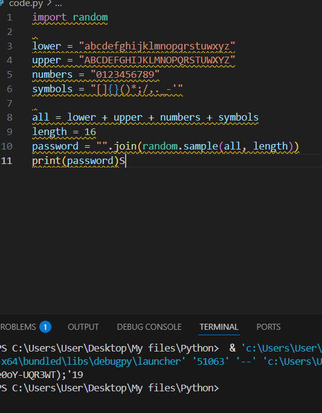

# Raport o blędzie

## Numer / identyfikator błędu

01

## Tytuł błędu

Generator hasła nie działa poprawnie

## Priorytet

High

## Platforma / środowisko

Windows 11 / Python 3.13.0

## Opis

program nie generuje 16 znakowego hasła z powodu wielu błędów w kodzie

## Kroki do reprodukcji

Uruchomienie programu
Odczytać wygenerowane hasło

## Oczekiwany i rzeczywisty wynik

wygenerowane hasło o długości 16 znaków, not worki

## Zrzut ekranu

