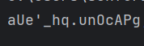

# Raport o błędzie

## Numer / identyfikator błędu
1

## Tytuł błędu
Generator hasła nie generuje hasła o odpowiedniej długości

## Priorytet
High

## Platforma / środowisko
Windows 10, Python 3.7.3

## Opis
Generator hasła nie generuje hasła o odpowiedniej długości. Program powinien generować hasło o długości 16 znaków, ale w rzeczywistości generuje hasło o długości 15 znaków.

## Kroki do reprodukcji
1. Uruchomić program
2. Odczytać wygenerowane hasło

## Oczekiwany i rzeczywisty wynik
Oczekiwany wynik: hasło o długości 16 znaków
Rzeczywisty wynik: hasło o długości 15 znaków

## Zrzut ekranu
